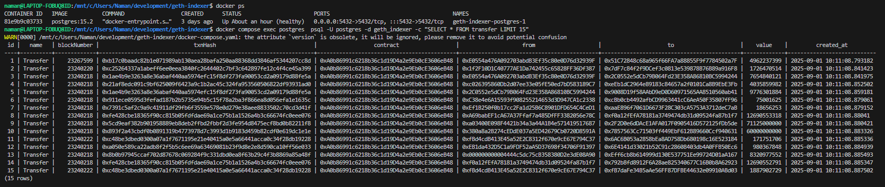

# 🚀 Ethereum Event Indexer

<div align="center">
  
  
  
</div>

A small, production-oriented Go application that indexes Ethereum contract events (historical + live) and stores them into PostgreSQL.

Highlights
- Real-time and historical event indexing
- ABI fetching (Etherscan) with proxy/implementation detection
- Safe, parameterized inserts to Postgres
- Minimal, auditable codebase using go-ethereum RPC client

## 📸 Screenshots

Below are a few screenshots from a working run — add/update images in `assets/` as needed.

<div align="center">

<p></p>
  
  <p></p>
  
</div>


## 🏗 Architecture

The codebase is intentionally compact and split into three roles:

- `subscriber/` — connects to Ethereum nodes, fetches contract ABIs, builds `ethereum.FilterQuery`s, fetches historical logs, and subscribes to live logs.
- `indexer/` — accepts decoded events and persists them to Postgres (parameterized INSERTs, ON CONFLICT dedupe).
- `cli/` — config parsing and wiring of the pipeline.

Flow (high-level):

1. CLI loads configuration (env, yaml, flags).
2. `subscriber` fetches contract ABI (via Etherscan) and maps events -> topic0 hashes.
3. It calls `FilterLogs` for historical logs and `SubscribeFilterLogs` for live logs (both provided by go-ethereum `ethclient`).
4. Logs are decoded using the ABI (indexed topics + data) and emitted on a channel.
5. `indexer` reads events from the channel and writes them into Postgres.

## 🔧 Libraries & Tools Used

- Go stdlib: `context`, `database/sql`, `net/http`, `encoding/json`, `log`, `math/big`.
- go-ethereum (`github.com/ethereum/go-ethereum`): `ethclient`, `types`, `common`, `accounts/abi` — used for RPC, log filtering/subscription and decoding ABIs.
- godotenv (`github.com/joho/godotenv`) for local .env support (recommended).
- lib/pq (`github.com/lib/pq`) Postgres driver.

## ⚙️ Etherscan API & RPC URL

- Etherscan ABI endpoint is used to fetch contract ABIs. The app expects an API key in `ETHERSCAN_API_KEY` (see `subsrciber/abi.go` – `fetchABI` and `getProxyInfoAndImplementation`).
- RPC connection (websocket or http) is provided via `RPC_URL`. Provide a reliable RPC endpoint (WSS recommended for live subscriptions).

Environment variables (common):

```env
CONTRACT_ADDRESS=0x...
START_BLOCK=0
END_BLOCK=latest
EVENT_NAME=Transfer
ETHERSCAN_API_KEY=your_key
RPC_URL=wss://mainnet.infura.io/ws/v3/your_key
DB_HOST=localhost
DB_PORT=5432
DB_USER=postgres
DB_PASSWORD=postgres
DB_NAME=geth_indexer
```

## 🔎 How we use go-ethereum client (filtered & live logs)

The project relies on two `ethclient.Client` features:

- `FilterLogs(ctx, q)` — used by `subsrciber/filter` to fetch historical logs matching an `ethereum.FilterQuery` (from/to blocks, address, topics).
  - The function builds a `ethereum.FilterQuery` (see `subsrciber/util.go` `filter`) and calls `client.FilterLogs(context.Background(), query)` to get past logs in a single RPC call.

- `SubscribeFilterLogs(ctx, q, ch)` — used by `subsrciber/listen` to subscribe to live logs.
  - `listen` creates a `logs := make(chan types.Log)` and calls `client.SubscribeFilterLogs(context.Background(), query, logs)` so incoming logs are streamed into the channel.

These two primitives give a reliable historical + live pipeline: `filter` returns a slice of past logs, and `listen` returns a subscription and a channel that receives new logs.

Files to inspect for behavior:

- `subsrciber/util.go` — contains `filter` and `listen` functions that wrap `FilterLogs` and `SubscribeFilterLogs`.
- `subsrciber/abi.go` — ABI fetch + proxy detection (`getProxyInfoAndImplementation`) used prior to decoding.

## 🗃 Database schema & migrations

- Migration file: `migrations/001_create_transfer_table.sql` creates the `transfer` table (the app will also attempt to create the table at startup).
- Table stores standard fields plus event-specific columns (for Transfer: `from`, `to`, `value`).
- Inserts are parameterized and use `ON CONFLICT (...) DO NOTHING` to avoid duplicates (historical + live overlap).

## 🐳 Docker / Postgres (quick start)

If you use `docker-compose.yaml` in this repo, start services with:

```bash
# build & start Postgres only (pull latest image then start postgres)
docker compose pull postgres && docker compose up -d --no-deps --no-build postgres
```

To open a psql shell for the Postgres service (replace `<svc>` with the service name shown by `docker compose ps`, commonly `db` or `postgres`):

```bash
# list containers and names
docker compose ps

# show first 15 rows from transfer (service name: postgres)
docker compose exec postgres psql -U postgres -d geth_indexer -c "SELECT * FROM transfer LIMIT 15"

# open interactive psql shell (service name: postgres)
docker compose exec postgres psql -U postgres -d geth_indexer
```

If you prefer `docker run` directly:

```bash
docker run --name geth-indexer-pg -e POSTGRES_PASSWORD=postgres -e POSTGRES_DB=geth_indexer -p 5432:5432 -d postgres:15
```

Run the migration file inside the container (example using `docker exec`):

```bash
docker exec -i geth-indexer-pg psql -U postgres -d geth_indexer -f /path/in/container/migrations/001_create_transfer_table.sql
```

Or use the included automatic table creation: the `indexer.Connect` function attempts to create the `transfer` table on startup.

## ▶️ Run the indexer

From the project root (WSL recommended) run the Go project directly (do not use Docker for the app):

```bash
# run the indexer with the event name exactly as shown in screenshots
go run main.go <event-name>

# example
go run main.go Transfer
```


## 📝 Notes about proxies and ABI

- Some tokens are deployed behind proxy contracts. The code calls Etherscan `getsourcecode` to detect proxy deployments and will fetch the implementation address ABI when available (`subsrciber/abi.go`).
- ABI decoding merges indexed topic values (from `log.Topics`) and non-indexed data (from `log.Data`) to build event objects for indexing.

## ❤️ Contributing

PRs welcome. Open issues for bugs or feature requests.

Happy indexing! ⚡

